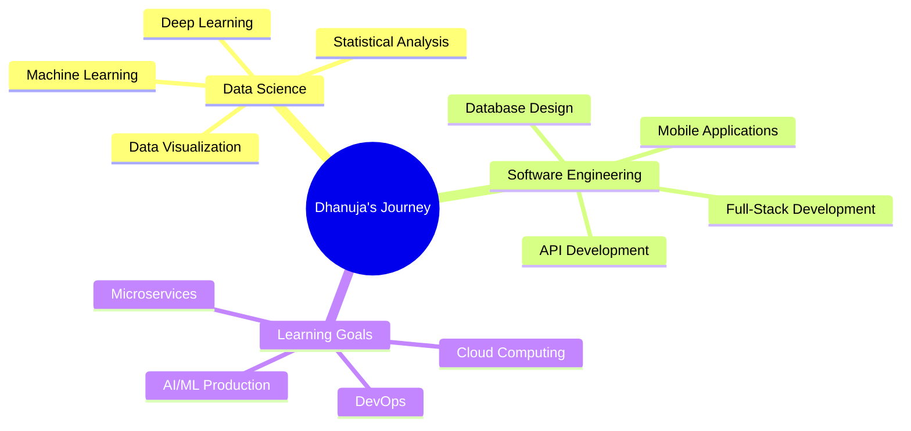

#  Hello World! I'm Dhanuja Rehan

<div align="center">
  
</div>

<div align="center">
  
</div>

<div align="center">
  
[](https://github.com/DhanujaRehan)
[](https://github.com/DhanujaRehan/?tab=follow)
[](https://github.com/DhanujaRehan)

</div>

---

## 🚀 About Me


```python
class DataScientist:
    def __init__(self):
        self.name = "Dhanuja Rehan"
        self.role = "Data Science Undergraduate & Software Engineer"
        self.university = "Cardiff Metropolitan University"
        self.languages = ["Python", "Java", "JavaScript", "R", "PHP", "C++", "C#"]
        self.interests = ["Machine Learning", "Web Development", "Open Source"]
        self.currently_learning = ["Deep Learning", "Cloud Computing", "DevOps"]
        self.fun_fact = "I watch movies and code as the sun rises ☀️"
    
    def say_hi(self):
        print("Thanks for dropping by! Let's build something amazing together!")

me = DataScientist()
me.say_hi()
```

---

## 🛠️ Tech Arsenal

<div align="center">

### 📊 Data Science & Analytics


### 💻 Programming Languages


### 🌐 Web Development


### 📱 Mobile Development


### 🗄️ Databases


### 🛠️ Tools & Technologies


</div>

---

## 📊 GitHub Analytics

<div align="center">
  
  
</div>

<div align="center">
  
</div>

<div align="center">
  
</div>

---

## 🎯 Current Focus

<div align="center">



</div>

---

## 🌟 Featured Projects

<div align="center">

[](https://github.com/DhanujaRehan/data-science-portfolio)
[](https://github.com/DhanujaRehan/mobile-app-development)

</div>

---

## 📈 Contribution Graph

<div align="center">
  
</div>

---

## 🤝 Let's Connect!

<div align="center">

### 🌐 Social Networks
[](https://www.linkedin.com/in/dhanuja-rehan-jayakody-9138831ba)
[](https://www.instagram.com/d_rehan_j)
[](https://www.facebook.com/share/m6cTmDGv7LKvH1Q8)
[](https://x.com/dhanujarehan)

### 📫 Reach Out
[](mailto:your.email@gmail.com)
[](https://your-portfolio-url.com)

</div>

---

## 💭 Random Dev Quote

<div align="center">
  
</div>

---

## 🎵 Currently Vibing To

<div align="center">
  
</div>

---

## 🏆 Achievements & Certifications

<div align="center">


</div>

---

<div align="center">
  
  
  ### ⭐ From [DhanujaRehan](https://github.com/DhanujaRehan) with ❤️
  
  
  
</div>

---

<div align="center">
  
</div>
