#  Hello World! ආයුබෝවන් / こんにちは !  I'm Dhanuja Rehan

<div align="center">
  
</div>

<div align="center">
  
</div>

<div align="center">
  
[](https://github.com/DhanujaRehan)
[](https://github.com/DhanujaRehan/?tab=follow)
[](https://github.com/DhanujaRehan)

</div>


<br>

##  **About Me**


```python
class DataScientist:
    def __init__(self):
        self.name = "Dhanuja Rehan"
        self.role = "Data Science Undergraduate & Software Engineer"
        self.university = "Cardiff Metropolitan University"
        self.languages = ["Python", "Java", "JavaScript", "R", "PHP", "C++", "C#"]
        self.interests = ["Machine Learning", "Web Development", "Open Source"]
        self.currently_learning = ["Pandas", "Python Advanced", "Power BI", "Deep Learning"]
        self.fun_fact = "I watch movies and code as the sun rises ☀️"
    
    def say_hi(self):
        print("Thanks for dropping by! Let's build something amazing together!")

me = DataScientist()
me.say_hi()
```


<br>

##  **Tech Universe**

<div align="center">

### 📊 Data Science & Analytics
<p>


</p>

### 💻 Programming Languages
<p>


</p>

### 🌐 Web Development
<p>


</p>

### 📱 Mobile Development
<p>

</p>

### 🗄️ Databases
<p>


</p>

### 🛠️ Tools & Technologies
<p>


</p>

### 📈 Currently Learning

<table align="center">
<tr>
<td align="center" width="150">

<br><strong>🐼 Pandas</strong>
<br><progress value="85" max="100"></progress>
</td>
<td align="center" width="150">

<br><strong>🐍 Advanced Python</strong>
<br><progress value="80" max="100"></progress>
</td>
<td align="center" width="150">

<br><strong>📊 Power BI</strong>
<br><progress value="70" max="100"></progress>
</td>
<td align="center" width="150">

<br><strong>🧠 Deep Learning</strong>
<br><progress value="60" max="100"></progress>
</td>
</tr>
</table>

</div>


<br>

## 📊 GitHub Analytics

<div align="center">
  
  
</div>

<div align="center">
  
</div>

<div align="center">
  
</div>


<br>

## 🎯 Current Learning Journey

```mermaid
mindmap
  root((Dhanuja's Journey 2025))
    Data Science
      🐼 Pandas Mastery
      📊 Power BI Analytics  
      🤖 Machine Learning
      📈 Statistical Analysis
      🎨 Data Visualization
    Software Engineering
      🌐 Full-Stack Development
      📱 Mobile Applications
      🔗 API Development
      💾 Database Design
    Advanced Skills
      🐍 Python Advanced
      ☁️ Cloud Computing
      🚀 DevOps
      🧠 Deep Learning
      🏗️ Microservices
```

<div align="center">



</div>


<br>

## 🌟 Featured Projects

<div align="center">

[](https://github.com/DhanujaRehan/data-science-portfolio)
[](https://github.com/DhanujaRehan/CodeVerse.git)

</div>


<br>

## 📈 Contribution Graph

<div align="center">
  
</div>


<br>

## 🏆 GitHub Profile Summary

<div align="center">
  
</div>

---

## 🤝 Let's Connect!

<div align="center">

### 🌐 Social Networks
<p>
<a href="https://www.linkedin.com/in/dhanuja-rehan-jayakody-9138831ba">
  
</a>
<a href="https://www.instagram.com/d_rehan_j">
  
</a>
<a href="https://www.facebook.com/share/m6cTmDGv7LKvH1Q8">
  
</a>
<a href="https://x.com/dhanujarehan">
  
</a>
</p>

### 📫 Reach Out
<p>
<a href="mailto:dhanujarehan@gmail.com">
  
</a>
<a href="https://your-portfolio-url.com">
  
</a>
</p>

</div>

---

## 💭 Random Dev Quote

<div align="center">
  
</div>

---

## 🏅 Achievements & Certifications

<div align="center">

<table>
<tr>
<td align="center">

<br><strong>Data Science Student</strong>
</td>
<td align="center">

<br><strong>Undergraduate</strong>
</td>
<td align="center">

<br><strong>Developer</strong>
</td>
</tr>
</table>

</div>

---

## 📚 Learning Progress

<div align="center">

```text
Pandas           ████████████████████░░   80%
Python Advanced  ███████████████████░░░   75%
Power BI         ██████████████░░░░░░░░   60%
Deep Learning    ███████████░░░░░░░░░░░   50%
```

</div>

---

<div align="center">
  
  
  ### ⭐ From [DhanujaRehan](https://github.com/DhanujaRehan) with ❤️
  
  
  
</div>

---

<div align="center">
  
</div>
